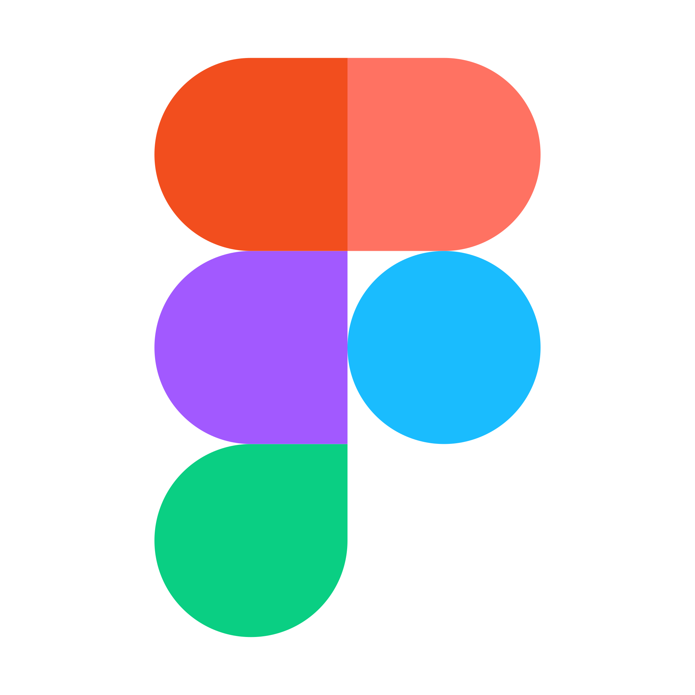

# 👋 Hello there! I'm NIkita Galkin
- 🌱 I’m currently learning: React Hook Form | React Query | Firebase | Express.js
- 🔭 I’m currently working on: TypeScript | React | Effector | Tailwind 

## ⭐ Stack 
> Base

|  HTML |  CSS |  pnpm |  yarn |  npm |  JavaScript |  TypeScript |  GIT |  Figma |
| --- | --- | --- | --- | --- | --- | --- | --- | --- | 

> Code control
|     |     |     | 
| --- | --- | --- |
|  Prettier |  Stylelint |  Eslint |
<!-- | --- | --- | --- | -->

> Frontend

|  React |  Sass |  Tailwind |  Redux |  Bootstrap |  Webpack |  Vite |
| --- | --- | --- | --- | --- | --- | --- |

> Backend

|  Firebase |
| --- |

